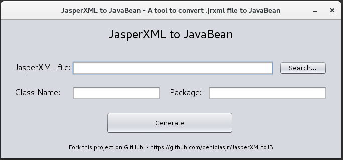

# JasperXMLtoJB
JasperXMLtoJB is a tool that convert a .jrxml file to a JavaBean.



You can import his library and use it on your project like this:

```java
JasperXMLtoJB jasperJB = new JasperXMLtoJB();
        
jasperJB.setJasperXMLFile("/your/folder/jasper_xml.jrxml");        
jasperJB.setClassName("JasperClass");        
jasperJB.setPackage("br.deni.jasperxmltojb");

jasperJB.render();        
jasperJB.save("/your/folder/");

```

If you like this project and feel good to contribute with, fork this!